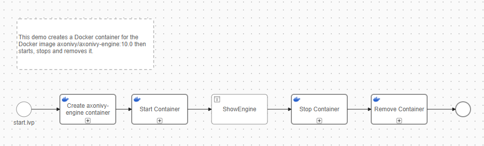
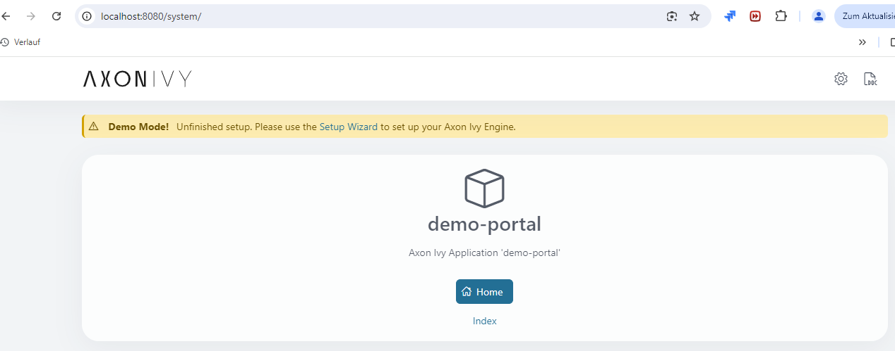
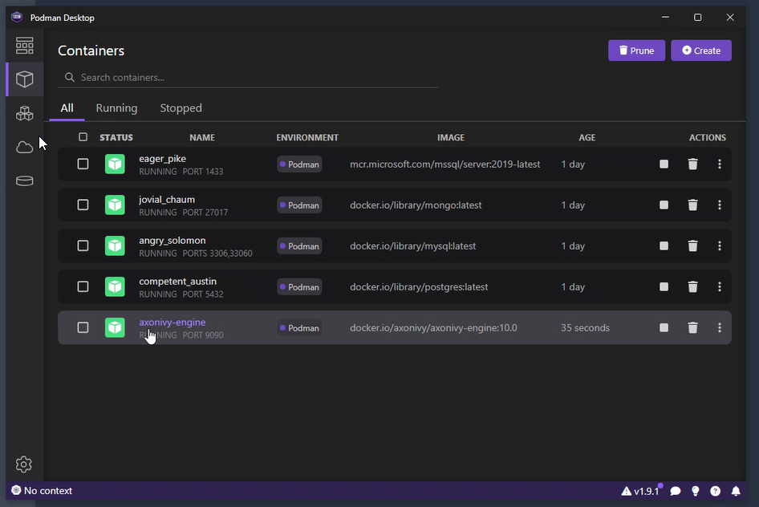
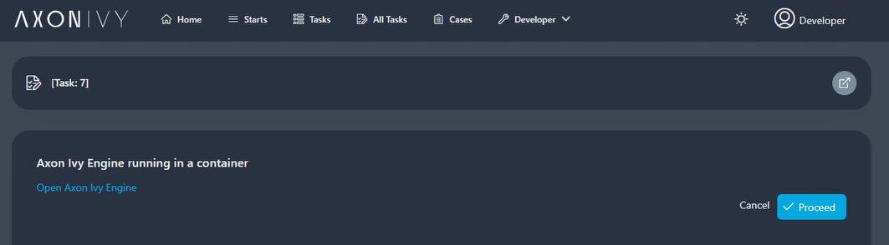
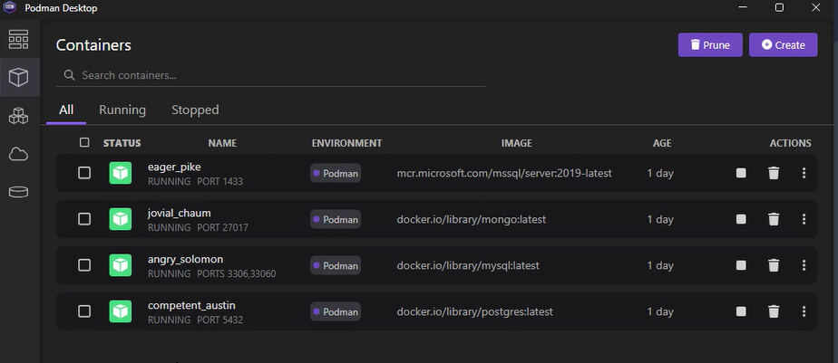

# Hafenarbeiter Anschluss

Behälter sind leichtgewichtige, abgelegene Einheiten jene Päckchen Anträge mit
ihren Kolonien, sichernd Beschaffenheit und #Tragbarkeit über verschieden
Umwelten. Hafenarbeiter ist ein weit-benutzt Bahnsteig mit einem
Dämon-basisbezogene Architektur versieht jener extensives Behälter Management
Charakterzüge und Ökosystem Tools gleichnamig Hafenarbeiter #Nabe und
Hafenarbeiter Fasst ab. Podman, Ein #abwechselnd zu Hafenarbeiter, auch bringt
fertig Behälter aber operieren ohne einem zentralen Dämon, fokussieren auf
Sicherheit und Einfachheit. Beide Tools können Hafenarbeiter Behälter Images
bedienen und teilen ähnliche #Befehl-Linie Funktionalitäten, machend Wechsel
zwischen jene leichter. Weile Hafenarbeiter vertraut auf eine Hintergrund
Bedienung, Podmans daemonless Design erlaubt für direkt Management von Behälter.

**Mit unseren Hafenarbeiter Anschluss kannst du schaffen, Start, stopp und
entfernen Hafenarbeiter Behälter in Hafenarbeiter Desktop oder herein Podman
direkt von einen #Axon Efeu dienstlichen Arbeitsgang.**

## Demo

Die Voraussetzung für den Demo Arbeitsgang ist dass ein Hafenarbeiter Dämon ist
rennen auf eurem Computer. Dies kann sein erreicht benutzen Tools gleichnamig
Hafenarbeiter Desktop oder Podman. In dem folgenden Beispiel, wir benutzten
Podman.

In der ersten Stufe zeigen wir dir zu schaffen wie einen Behälter für den #Axon
Efeu Motor benutzen mal den #Axon Efeu Motor Image findest du an Hafenarbeiter
#Nabe: Https://#Nabe.Hafenarbeiter.com/r/axonivy/axonivy-Motor.



#Nächste, der Behälter ist gestartet - und mit ihm einen Antrag weiter localhost
mit #welche einen #Axon Efeu Motor ist gestartet:



Der Behälter geschafft herein Podman:



Ein UI ist jetzt dabei geöffnet, welcher gibt du die Option von stoppen und
streichend nochmal diesen Behälter mal klicken "Verfährt".



Der Behälter ist jetzt entfernt von Podman:



## Einrichtung

Zu Einrichtung der Hafenarbeiter Connnector, füg zu die folgende Variable zu
euren #Axon Efeu Projiziert:
```
@variables.yaml@
```

Zu ermitteln das URL ob zu benutzen npipe (#Namens Pfeifen) oder TCP zu koppeln
zu euren Hafenarbeiter Dämon, du kannst verschiedene Befehle benutzen #abhängen
auf eurem Betriebssystem und Hafenarbeiter Einrichtung. Hier ist wie für
Hafenarbeiter zu überprüfen, Hafenarbeiter Desktop, und Podman auf Fenster,
macOS, und Linux:
### Fenster:
1. Hafenarbeiter Desktop: Gerannt herein diesen Befehl PowerShell:
    ```powershell
    docker context inspect default
    ```
   #Suchen die "Endpunkte" Sektion # nach. Ob du siehst "npipe://" Es benutzt
   #Namens Pfeifen. Ob du siehst "tcp://", Es benutzt TCP.
2. Podman: Podman Auf Fenster benutzen typischerweise TCP. Überprüf die
   Konfiguration Datei:
    ```
    cat $env:USERPROFILE\.config\containers\podman\machine\qemu\podman-machine-default.json
    ```
### macOS:
1. Hafenarbeiter Desktop: Gerannt diesen Befehl in Endständig:
    ```
    docker context inspect default
    ```
   #Suchen die "Endpunkte" Sektion # nach. Es sollte zeigen
   "unix:///var/Renn/Hafenarbeiter.Socke" für #Muffe Kommunikation.
2. Podman: Podman Weiter macOS typischerweise benutzt TCP. Überprüf die
   MaschineKonfiguration:
    ```
    podman machine inspect
    ```
   Such # nach das "ConnectionInfo.URI" #Auffangen.
### Linux:
1. Hafenarbeiter Desktop: Überprüf den Hafenarbeiter Dämon Konfiguration:
    ```
    sudo cat /etc/docker/daemon.json
    ```
   #Suchen die "Gastgeber # nach" #auffangen. Ob nicht gefunden, Hafenarbeiter
   ist wahrscheinlich benutzen #der #voreingestellt #Unix #Muffe. Du kannst auch
   überprüfen das systemd #bespringen #feilen:
    ```
    sudo systemctl cat docker.service
    ```
   Such # nach das "ExecStart" Linie zu sehen ob #irgendein TCP Optionen sind
   präzisiert.
2. Podman: Podman Auf Linux benutzt typischerweise eine #Unix #Muffe bei
   #voreingestellt. Überprüf die Konfiguration:
    ```
    cat /etc/containers/containers.conf
    ```
### Für Hafenarbeiter (alle Bahnsteige):
```
docker info --format '{{.Host}}'
```
Dies will zeigen du den gängigen Zusammenhang Methode seiend benutzt.


Erinner dass die effektive Konfiguration darf variieren #abhängen auf eurer
spezifischen Einrichtung und irgendwelche #benutzerdefiniert Konfigurationen
darfst du haben beworben.
